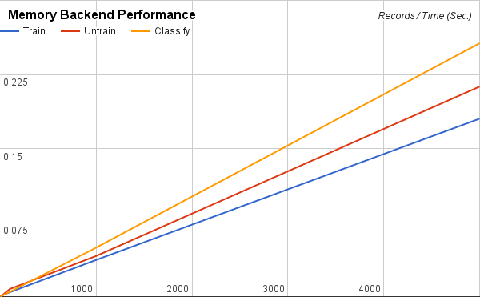
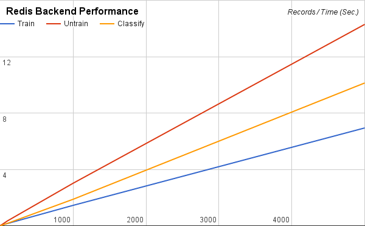
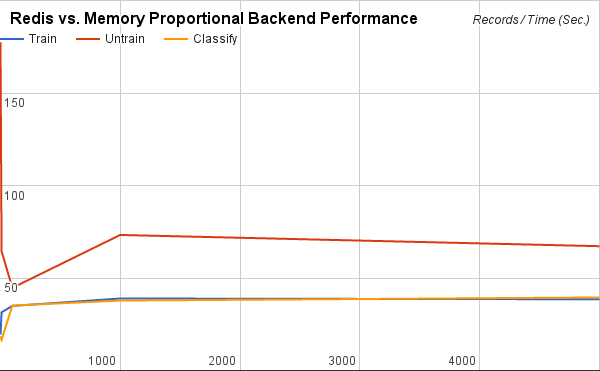

# {{ page.title }}

Bayesian Classifiers are accurate, fast, and have modest memory requirements.

**Note:** *Classifier only supports UTF-8 characters.*

## Basic Usage

```ruby
require 'classifier-reborn'

classifier = ClassifierReborn::Bayes.new 'Interesting', 'Uninteresting'
classifier.train_interesting "Here are some good words. I hope you love them."
classifier.train_uninteresting "Here are some bad words, I hate you."
classifier.classify "I hate bad words and you." #=> 'Uninteresting'

classifier_snapshot = Marshal.dump classifier
# This is a string of bytes, you can persist it anywhere you like

File.open("classifier.dat", "w") {|f| f.write(classifier_snapshot) }

# This is now saved to a file, and you can safely restart the application
data = File.read("classifier.dat")
trained_classifier = Marshal.load data
trained_classifier.classify "I love" #=> 'Interesting'
```

## Redis Backend

Alternatively, a [Redis](https://redis.io/) backend can be used for persistence. The Redis backend has some advantages over the default Memory backend.

* The training data remains safe in case of application crash.
* A shared model can be trained and used for classification from more than one applications (from one or more hosts).
* It scales better than local Memory.

These advantages come with an inherent performance cost though.
In our benchmarks we found the Redis backend (running on the same machine) about 40 times slower for training and classification than the default Memory backend (see the `Backent Benchmarks` section below for more details).

To enable Redis backend, use the dependency injection during the classifier initialization as illustrated below.

```ruby
require 'classifier-reborn'

redis_backend = ClassifierReborn::BayesRedisBackend.new
classifier = ClassifierReborn::Bayes.new 'Interesting', 'Uninteresting', backend: redis_backend

# Perform training and classification using the classifier instance
```

The above code will connect to the local Redis instance with the default configurations.
The Redis backend accepts the same arguments for initialization as the [redis-rb](https://github.com/redis/redis-rb) library.
The following example illustrates connection to a Redis instance with custom configurations.

```ruby
require 'classifier-reborn'

redis_backend = ClassifierReborn::BayesRedisBackend.new {host: "10.0.1.1", port: 6380, db: 2}
# Or
# redis_backend = ClassifierReborn::BayesRedisBackend.new url: "redis://:secret@10.0.1.1:6380/2"
classifier = ClassifierReborn::Bayes.new 'Interesting', 'Uninteresting', backend: redis_backend

# Perform training and classification using the classifier instance
```

## Beyond the Basics

Beyond the basic example, the constructor and trainer can be used in a more flexible way to accommodate non-trival applications.
Consider the following program.

```ruby
#!/usr/bin/env ruby

require 'classifier-reborn'

training_set = DATA.read.split("\n")
categories   = training_set.shift.split(',').map{|c| c.strip}

# pass :auto_categorize option to allow feeding previously unknown categories
classifier = ClassifierReborn::Bayes.new categories, auto_categorize: true

training_set.each do |a_line|
  next if a_line.empty? || '#' == a_line.strip[0]
  parts = a_line.strip.split(':')
  classifier.train(parts.first, parts.last)
end

puts classifier.classify "I hate bad words and you" #=> 'Uninteresting'
puts classifier.classify "I hate javascript" #=> 'Uninteresting'
puts classifier.classify "JavaScript is bad" #=> 'Uninteresting'

puts classifier.classify "All you need is ruby" #=> 'Interesting'
puts classifier.classify "I love ruby" #=> 'Interesting'

puts classifier.classify "Which is better dogs or cats" #=> 'dog'
puts classifier.classify "What do I need to kill rats and mice" #=> 'cat'

__END__
Interesting, Uninteresting
interesting: Here are some good words. I hope you love them
interesting: All you need is love
interesting: The love boat, soon we will be taking another ride
interesting: Ruby don't take your love to town

uninteresting: Here are some bad words, I hate you
uninteresting: Bad bad leroy brown badest man in the darn town
uninteresting: The good the bad and the ugly
uninteresting: Java, JavaScript, CSS front-end HTML
#
# Train categories that were not pre-described
#
dog: Dog days of summer
dog: A man's best friend is his dog
dog: A good hunting dog is a fine thing
dog: Man my dogs are tired
dog: Dogs are better than cats in soooo many ways

cat: The fuzz ball spilt the milk
cat: Got rats or mice get a cat to kill them
cat: Cats never come when you call them
cat: That dang cat keeps scratching the furniture
```

## Knowing the Score

When you ask a Bayesian classifier to classify text against a set of trained categories it does so by generating a score (as a Float) for each possible category.
The higher the score the closer the fit your text has with that category.
The category with the highest score is returned as the best matching category.

In `ClassifierReborn` the methods `classifications` and `classify_with_score` give you access to the calculated scores.
The method `classify` only returns the best matching category.

Knowing the score allows you to do some interesting things.
For example, if your application is to generate tags for a blog post you could use the `classifications` method to get a hash of the categories and their scores.
You would sort on score and take only the top three or four categories as your tags for the blog post.

You could within your application establish the smallest acceptable score and only use those categories whose score is greater than or equal to your smallest acceptable score as your tags for the blog post.

What if you only use the `classify` method?
It does not show you the score of the best category.
How do you know that the best category is really any good?

You can use the threshold.

## Using the Threshold

Some applications can have only one category.
The application wants to know if the text being classified is of that category or not.
For example consider a list of normal free text responses to some question or maybe a URL string coming to your web application.
You know what a normal response looks like, but you have no idea how people might misuse the response.
So what you want to do is create a Bayesian classifier that just has one category, for example, `Good` and you want to know whether your text is classified as `Good` or `Not Good`.
Or suppose you just want the ability to have multiple categories and a `None of the Above` as a possibility.

### Setting up a Threshold

When you initialize the `ClassifierReborn::Bayes` classifier there are several options which can be set that control threshold processing.

```ruby
b = ClassifierReborn::Bayes.new(
        'good',                 # one or more categories
        enable_threshold: true, # default: false
        threshold: -10.0        # default: 0.0
      )
b.train_good 'Good stuff from Dobie Gillis'
# ...
text = 'Bad junk from Maynard G. Krebs'
result = b.classify text
if result.nil?
  STDERR.puts "ALERT: This is not good: #{text}"
  let_loose_the_dogs_of_war!  # method definition left to the reader
end
```

In the `classify` method when the best category for the text has a score that is either less than the established threshold or is Float::INIFINITY, a nil category is returned.
When you see a nil value returned from the `classify` method it means that none of the trained categories (regardless or how many categories were trained) has a score that is above or equal to the established threshold.

### Threshold-related Convenience Methods

```ruby
b.threshold            # get the current threshold
b.threshold = -10.0    # set the threshold
b.threshold_enabled?   # Boolean: is the threshold enabled?
b.threshold_disabled?  # Boolean: is the threshold disabled?
b.enable_threshold     # enables threshold processing
b.disable_threshold    # disables threshold processing
```

Using these convenience methods your applications can dynamically adjust threshold processing as required.

## Backend Benchmarks

The following benchmarks were performed using the [SMS Spam Collection v.1](http://dcomp.sor.ufscar.br/talmeida/smsspamcollection/) dataset. `1`, `10`, `100`, `1,000`, and `5,000` records from the top of the dataset were used to `train`, `untrain`, and `classify` for both `Memory` and `Redis` backends (the `Redis` server was running locally). Tables represent values based on the observations of `5,000` records. The data used in these benchmarks can be found in [this spreadsheet](https://docs.google.com/spreadsheets/d/11pRZY1vbxWANcO6ABG-SuoUVqypjM45728Zk0uXog1s/edit?usp=sharing).

### Memory Backend Performance

| Operation | Ops/sec. |
|:----------|---------:|
| Train     |    27750 |
| Untrain   |    23508 |
| Classify  |    19487 |



### Redis Backend Performance

| Operation | Ops/sec. |
|:----------|---------:|
| Train     |      721 |
| Untrain   |      350 |
| Classify  |      494 |



### Redis vs. Memory Proportional Backend Performance

| Operation | Redis/Memory (Time) |
|:----------|--------------------:|
| Train     |                  39 |
| Untrain   |                  67 |
| Classify  |                  39 |



## References

* [Naive Bayes classifier](https://en.wikipedia.org/wiki/Naive_Bayes_classifier)
* [Introduction to Bayesian Filtering](http://web.archive.org/web/20131205153329/http://www.process.com/precisemail/bayesian_filtering.htm)
* [Bayesian filtering](http://en.wikipedia.org/wiki/Bayesian_filtering)
* [A Plan for Spam](http://www.paulgraham.com/spam.html)
